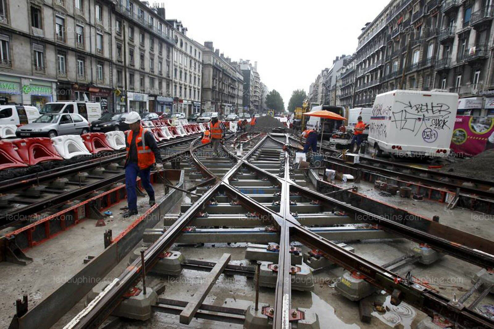

# detection-des-defauts-de-voies-des-rails-de-tramways

On s'intéresse à la détection des défauts de voies des rails de tramways, pour cela on va faire de clustering afin de repérer les positionnements des chocs sur une ligne donnnée de tramway pour ensuit voir si les positionnements des chocs se répètent (ce qui indique probablement que les capteurs aveient bien fonctionné) ou si les positionnements des chocs n'apparaissent que peu de fois (ce qui indique une mauvaise fonctionnement.

